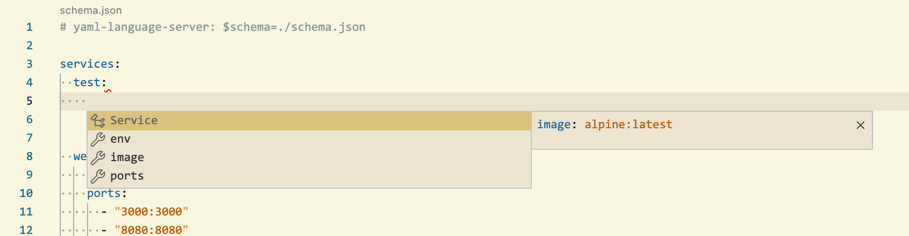
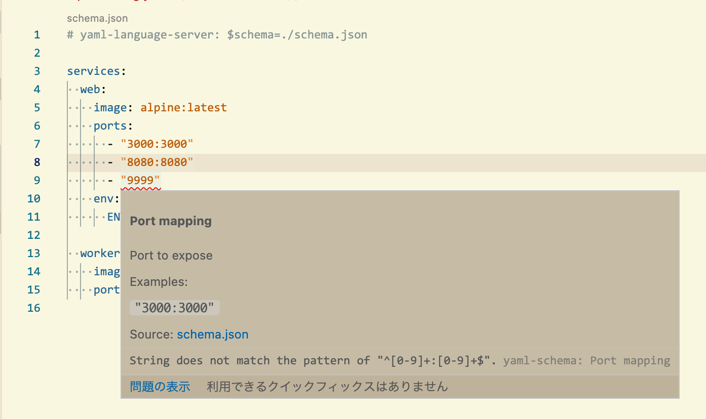

# An example to use editor support for custom YAML file

This is an example of using editor support (of [yaml-language-server](https://github.com/redhat-developer/yaml-language-server)) for custom YAML file by associating its JSON Schema.

In this example, we define a custom YAML schema like Docker compose. (Example file: [./example-config.yaml](./example-config.yaml))





## Detailed explanation

TBW

## Output Schema

```
go run main.go > schema.json
```
